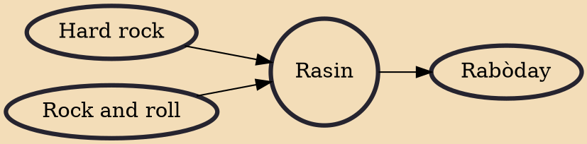

Rasin, also known as Haitian roots music, is a musical style that began in Haiti in the 1970s when musicians began combining elements of traditional Haitian Vodou ceremonial and folkloric music with various musical styles. The late 20th century style of this music links to the roots of Vodou tradition, where it came to be known as mizik rasin later in Haitian Creole. Modern-day, the movement is often referred to simply as "rasin" or "racine" (in French).

## Influences
- [[Hard rock]]
- [[Rock and roll]]

## Derivatives
- [[Rabòday]]
