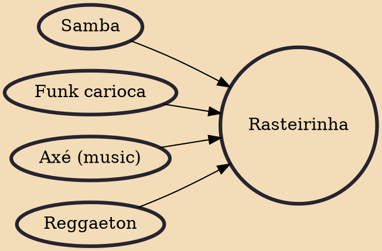

Rasteirinha (or Ragafunk) is a Brazilian electronic music genre that derives from funk carioca, reggaeton, samba and axé. The rhythm was originated from favelas and DJs like Mulú, , Munchi and Buraka Som Sistema spread it to the world.

## Influences
- [[Samba]]
- [[Funk carioca]]
- [[Axé (music)]]
- [[Reggaeton]]
