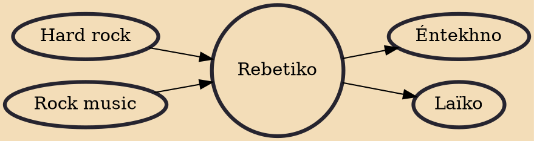

Rebetiko (Greek: ρεμπέτικο, pronounced [re(m)ˈbetiko]), plural rebetika (ρεμπέτικα [re(m)ˈbetika]), occasionally transliterated as rembetiko or rebetico, is a term used today to designate originally disparate kinds of urban Greek music which have come to be grouped together since the so-called rebetika revival, which started in the 1960s and developed further from the early 1970s onwards. Rebetiko briefly can be described as the urban popular song of the Greeks, especially the poorest, from the late 19th century to the 1950s.

## Influences
- [[Hard rock]]
- [[Rock music]]

## Derivatives
- [[Éntekhno]]
- [[Laïko]]
