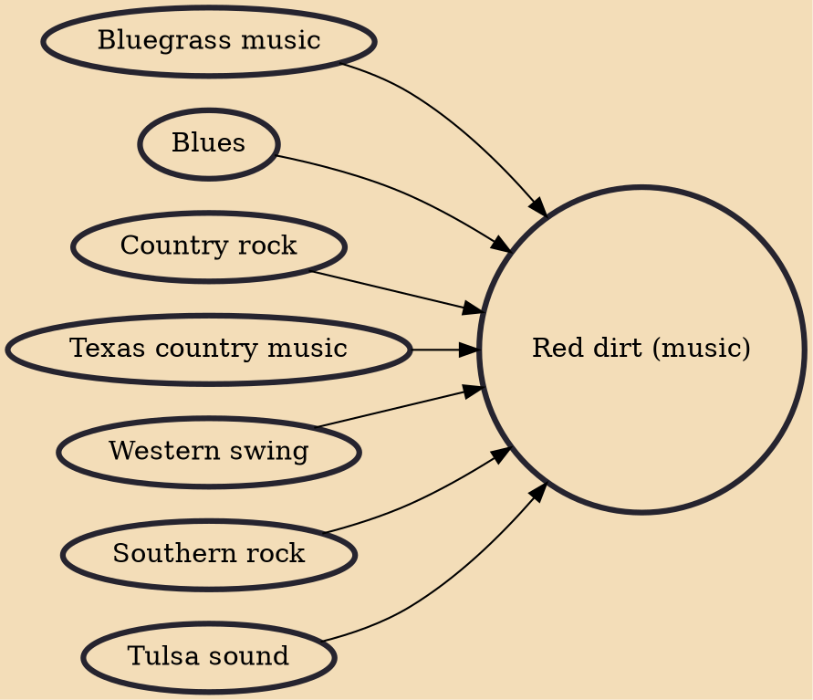

Red Dirt is a genre of country music that gets its name from the color of soil found in Oklahoma. Many Red Dirt acts got their start in bars surrounding Oklahoma State University in Stillwater, a city considered to be the center of Red Dirt music. The genre also extends to music made south of the Red River in Texas. Outlaw country legends Waylon Jennings and Willie Nelson have been associated with the distinctive Texas sound, while the late Oklahoma singer-songwriter Bob Childers is widely recognized as the Father of Oklahoma Red Dirt music. At one time, the distinction between the two genres was sonically obvious, but by 2008, that gap had diminished.

## Influences

- [[Bluegrass music]]
- [[Blues]]
- [[Country rock]]
- [[Texas country music]]
- [[Western swing]]
- [[Southern rock]]
- [[Tulsa sound]]
