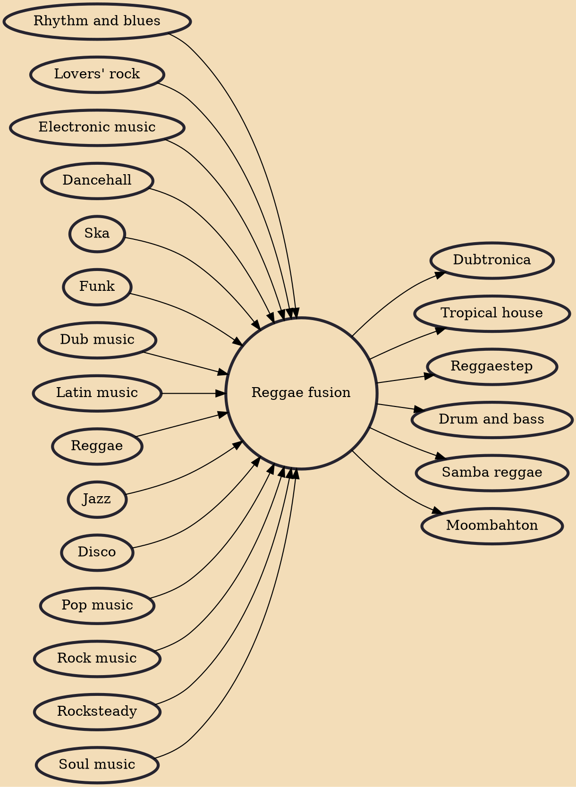

Reggae fusion is a genre of reggae that mixes reggae and/or dancehall with other genres, such as pop, rock, hip hop, R&B, jazz, funk, soul, disco, electronic and latin.

## Influences
- [[Rhythm and blues]]
- [[Lovers' rock]]
- [[Electronic music]]
- [[Dancehall]]
- [[Ska]]
- [[Funk]]
- [[Dub music]]
- [[Latin music]]
- [[Reggae]]
- [[Jazz]]
- [[Disco]]
- [[Pop music]]
- [[Rock music]]
- [[Rocksteady]]
- [[Soul music]]

## Derivatives
- [[Dubtronica]]
- [[Tropical house]]
- [[Reggaestep]]
- [[Drum and bass]]
- [[Samba reggae]]
- [[Moombahton]]
