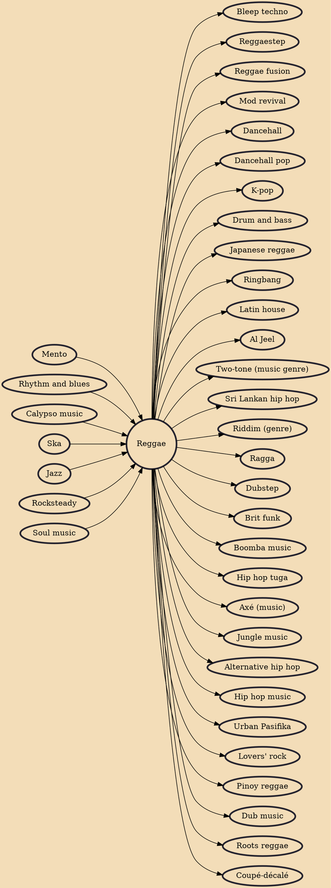

Reggae (/ˈrɛɡeɪ/) is a music genre that originated in Jamaica in the late 1960s. The term also denotes the modern popular music of Jamaica and its diaspora. A 1968 single by Toots and the Maytals, "Do the Reggay" was the first popular song to use the word "reggae", effectively naming the genre and introducing it to a global audience. While sometimes used in a broad sense to refer to most types of popular Jamaican dance music, the term reggae more properly denotes a particular music style that was strongly influenced by traditional mento as well as American jazz and rhythm and blues, and evolved out of the earlier genres ska and rocksteady. Reggae usually relates news, social gossip, and political commentary. It is instantly recognizable from the counterpoint between the bass and drum downb

## Influences
- [[Mento]]
- [[Rhythm and blues]]
- [[Calypso music]]
- [[Ska]]
- [[Jazz]]
- [[Rocksteady]]
- [[Soul music]]

## Derivatives
- [[Bleep techno]]
- [[Reggaestep]]
- [[Reggae fusion]]
- [[Mod revival]]
- [[Dancehall]]
- [[Dancehall pop]]
- [[K-pop]]
- [[Drum and bass]]
- [[Japanese reggae]]
- [[Ringbang]]
- [[Latin house]]
- [[Al Jeel]]
- [[Two-tone (music genre)]]
- [[Sri Lankan hip hop]]
- [[Riddim (genre)]]
- [[Ragga]]
- [[Dubstep]]
- [[Brit funk]]
- [[Boomba music]]
- [[Hip hop tuga]]
- [[Axé (music)]]
- [[Jungle music]]
- [[Alternative hip hop]]
- [[Hip hop music]]
- [[Urban Pasifika]]
- [[Lovers' rock]]
- [[Pinoy reggae]]
- [[Dub music]]
- [[Roots reggae]]
- [[Coupé-décalé]]
