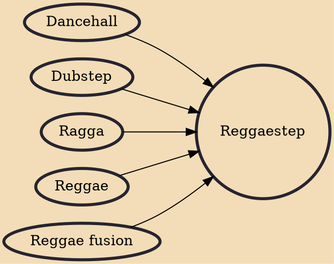

Reggaestep (portmanteau of reggae and dubstep) is a fusion genre of reggae music and dubstep that gained popularity online in the early 2010s, particularly on SoundCloud. Reggaestep typically has similar drum samples as those used in reggae; however, the timing of these drums corresponds with the typical syncopation of drums in dubstep. Other influence taken from reggae include harmonic accentuation of the offbeats, however off-beat rhythms can sometimes be layered on top of more traditional dubstep or ragga melodies. The tempo tends to be at 140 BPM which is typical to dubstep. The "drops" in reggaestep are very similar to those of dubstep, but often follow similar melody patterns to reggae.

## Influences
- [[Dancehall]]
- [[Dubstep]]
- [[Ragga]]
- [[Reggae]]
- [[Reggae fusion]]
