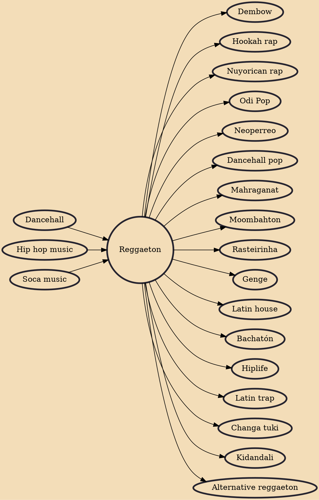

Reggaeton (UK: /ˈrɛɡeɪtoʊn, ˌrɛɡeɪˈtɒn/, US: /ˌrɛɡeɪˈtoʊn, ˌreɪɡ-/), also known as reggaetón and reguetón (Spanish: [reɣeˈton]), is a music style that originated in Panama during the late 1980s. It was later popularized in Puerto Rico. It has evolved from dancehall and has been influenced by American hip hop, Latin American, and Caribbean music. Vocals include rapping and singing, typically in Spanish.

## Influences
- [[Dancehall]]
- [[Hip hop music]]
- [[Soca music]]

## Derivatives
- [[Dembow]]
- [[Hookah rap]]
- [[Nuyorican rap]]
- [[Odi Pop]]
- [[Neoperreo]]
- [[Dancehall pop]]
- [[Mahraganat]]
- [[Moombahton]]
- [[Rasteirinha]]
- [[Genge]]
- [[Latin house]]
- [[Bachatón]]
- [[Hiplife]]
- [[Latin trap]]
- [[Changa tuki]]
- [[Kidandali]]
- [[Alternative reggaeton]]
