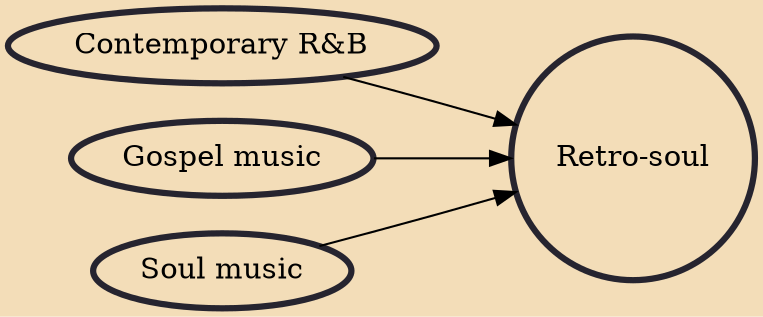

Retro soul, sometimes written as retro-soul, is a post-modern and contemporary popular music genre that emerged years after the golden era of soul music. In style of singing, arrangement and recording techniques, this music attempts to offer new music in the tradition of soul music from the United States from the 1950s to the 1970s. This differs from soul music, Contemporary R&B and neo soul as it is intentionally produced in a vintage recording sound and style years after the original era.

## Influences

- [[Contemporary R&B]]
- [[Gospel music]]
- [[Soul music]]
