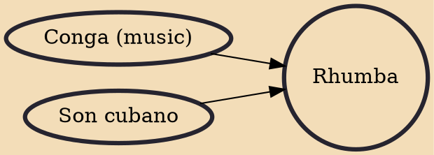

Rhumba, also known as ballroom rumba, is a genre of ballroom music and dance that appeared in the East Coast of the United States during the 1930s. It combined American big band music with Afro-Cuban rhythms, primarily the son cubano, but also conga and rumba. Although taking its name from the latter, ballroom rumba differs completely from Cuban rumba in both its music and its dance. Hence, authors prefer the Americanized spelling of the word (rhumba) to distinguish between them.

## Influences
- [[Conga (music)]]
- [[Son cubano]]
