```dot
digraph {
	graph [bgcolor="#F3DDB8" rankdir=LR]
	node [color="#26242F" penwidth=3.0]
	"Rhythm and blues" [shape=circle]
	"Americana (music)" [URL="/americana-music/"]
	"Americana (music)" -> "Rhythm and blues"
	Blues [URL="/blues/"]
	Blues -> "Rhythm and blues"
	"Swing music" [URL="/swing-music/"]
	"Swing music" -> "Rhythm and blues"
	"Jump blues" [URL="/jump-blues/"]
	"Jump blues" -> "Rhythm and blues"
	"Gospel music" [URL="/gospel-music/"]
	"Gospel music" -> "Rhythm and blues"
	Jazz [URL="/jazz/"]
	Jazz -> "Rhythm and blues"
	"Boogie-woogie" [URL="/boogie-woogie/"]
	"Boogie-woogie" -> "Rhythm and blues"
	"Traditional black gospel" [URL="/traditional-black-gospel/"]
	"Traditional black gospel" -> "Rhythm and blues"
	"Soul blues" [URL="/soul-blues/"]
	"Rhythm and blues" -> "Soul blues"
	"Louisiana blues" [URL="/louisiana-blues/"]
	"Rhythm and blues" -> "Louisiana blues"
	"Soul music" [URL="/soul-music/"]
	"Rhythm and blues" -> "Soul music"
	"Philadelphia soul" [URL="/philadelphia-soul/"]
	"Rhythm and blues" -> "Philadelphia soul"
	"Chicago soul" [URL="/chicago-soul/"]
	"Rhythm and blues" -> "Chicago soul"
	Ska [URL="/ska/"]
	"Rhythm and blues" -> Ska
	"Christian R&B" [URL="/christian-rb/"]
	"Rhythm and blues" -> "Christian R&B"
	"Hard bop" [URL="/hard-bop/"]
	"Rhythm and blues" -> "Hard bop"
	Disco [URL="/disco/"]
	"Rhythm and blues" -> Disco
	"Soul jazz" [URL="/soul-jazz/"]
	"Rhythm and blues" -> "Soul jazz"
	"V-pop" [URL="/v-pop/"]
	"Rhythm and blues" -> "V-pop"
	"Adult contemporary music" [URL="/adult-contemporary-music/"]
	"Rhythm and blues" -> "Adult contemporary music"
	Rockabilly [URL="/rockabilly/"]
	"Rhythm and blues" -> Rockabilly
	"Doo-wop" [URL="/doo-wop/"]
	"Rhythm and blues" -> "Doo-wop"
	"Reggae fusion" [URL="/reggae-fusion/"]
	"Rhythm and blues" -> "Reggae fusion"
	Palingsound [URL="/palingsound/"]
	"Rhythm and blues" -> Palingsound
	"Pub rock (United Kingdom)" [URL="/pub-rock-united-kingdom/"]
	"Rhythm and blues" -> "Pub rock (United Kingdom)"
	"New York soul" [URL="/new-york-soul/"]
	"Rhythm and blues" -> "New York soul"
	"Mod revival" [URL="/mod-revival/"]
	"Rhythm and blues" -> "Mod revival"
	"Lovers' rock" [URL="/lovers-rock/"]
	"Rhythm and blues" -> "Lovers' rock"
	"Psychedelic soul" [URL="/psychedelic-soul/"]
	"Rhythm and blues" -> "Psychedelic soul"
	Boogaloo [URL="/boogaloo/"]
	"Rhythm and blues" -> Boogaloo
	"Group sounds" [URL="/group-sounds/"]
	"Rhythm and blues" -> "Group sounds"
	"Lao pop" [URL="/lao-pop/"]
	"Rhythm and blues" -> "Lao pop"
	"Post-disco" [URL="/post-disco/"]
	"Rhythm and blues" -> "Post-disco"
	"K-pop" [URL="/k-pop/"]
	"Rhythm and blues" -> "K-pop"
	"Garage rock" [URL="/garage-rock/"]
	"Rhythm and blues" -> "Garage rock"
	"British soul" [URL="/british-soul/"]
	"Rhythm and blues" -> "British soul"
	"Memphis soul" [URL="/memphis-soul/"]
	"Rhythm and blues" -> "Memphis soul"
	"Korean ballad" [URL="/korean-ballad/"]
	"Rhythm and blues" -> "Korean ballad"
	"Thai pop music" [URL="/thai-pop-music/"]
	"Rhythm and blues" -> "Thai pop music"
	"Car song" [URL="/car-song/"]
	"Rhythm and blues" -> "Car song"
	Zydeco [URL="/zydeco/"]
	"Rhythm and blues" -> Zydeco
	"New Orleans rhythm and blues" [URL="/new-orleans-rhythm-and-blues/"]
	"Rhythm and blues" -> "New Orleans rhythm and blues"
	"British blues" [URL="/british-blues/"]
	"Rhythm and blues" -> "British blues"
	"Contemporary R&B" [URL="/contemporary-rb/"]
	"Rhythm and blues" -> "Contemporary R&B"
	"Smooth jazz" [URL="/smooth-jazz/"]
	"Rhythm and blues" -> "Smooth jazz"
	Funk [URL="/funk/"]
	"Rhythm and blues" -> Funk
	Reggae [URL="/reggae/"]
	"Rhythm and blues" -> Reggae
	"Heartland rock" [URL="/heartland-rock/"]
	"Rhythm and blues" -> "Heartland rock"
	"New Orleans blues" [URL="/new-orleans-blues/"]
	"Rhythm and blues" -> "New Orleans blues"
	"Hip hop music" [URL="/hip-hop-music/"]
	"Rhythm and blues" -> "Hip hop music"
	"Tejano music" [URL="/tejano-music/"]
	"Rhythm and blues" -> "Tejano music"
	"Zhongguo feng (music)" [URL="/zhongguo-feng-music/"]
	"Rhythm and blues" -> "Zhongguo feng (music)"
	"Brill Building (genre)" [URL="/brill-building-genre/"]
	"Rhythm and blues" -> "Brill Building (genre)"
	"Rock and roll" [URL="/rock-and-roll/"]
	"Rhythm and blues" -> "Rock and roll"
	"Rock music" [URL="/rock-music/"]
	"Rhythm and blues" -> "Rock music"
	"Jazz-funk" [URL="/jazz-funk/"]
	"Rhythm and blues" -> "Jazz-funk"
	"Dance-rock" [URL="/dance-rock/"]
	"Rhythm and blues" -> "Dance-rock"
}
```

Rhythm and blues, frequently abbreviated as R&B or R'n'B, is a genre of popular music that originated in African-American communities in the 1940s. The term was originally used by record companies to describe recordings marketed predominantly to urban African Americans, at a time when "urbane, rocking, jazz based music ... [with a] heavy, insistent beat" was becoming more popular.In the commercial rhythm and blues music typical of the 1950s through the 1970s, the bands usually consisted of piano, one or two guitars, bass, drums, one or more saxophones, and sometimes background vocalists. R&B lyrical themes often encapsulate the African-American experience of pain and the quest for freedom and joy, as well as triumphs and failures in terms of relationships, economics, and aspirations.

## Influences

- [[Americana (music)]]
- [[Blues]]
- [[Swing music]]
- [[Jump blues]]
- [[Gospel music]]
- [[Jazz]]
- [[Boogie-woogie]]
- [[Traditional black gospel]]

## Derivatives

- [[Soul blues]]
- [[Louisiana blues]]
- [[Soul music]]
- [[Philadelphia soul]]
- [[Chicago soul]]
- [[Ska]]
- [[Christian R&B]]
- [[Hard bop]]
- [[Disco]]
- [[Soul jazz]]
- [[V-pop]]
- [[Adult contemporary music]]
- [[Rockabilly]]
- [[Doo-wop]]
- [[Reggae fusion]]
- [[Palingsound]]
- [[Pub rock (United Kingdom)]]
- [[New York soul]]
- [[Mod revival]]
- [[Lovers' rock]]
- [[Psychedelic soul]]
- [[Boogaloo]]
- [[Group sounds]]
- [[Lao pop]]
- [[Post-disco]]
- [[K-pop]]
- [[Garage rock]]
- [[British soul]]
- [[Memphis soul]]
- [[Korean ballad]]
- [[Thai pop music]]
- [[Car song]]
- [[Zydeco]]
- [[New Orleans rhythm and blues]]
- [[British blues]]
- [[Contemporary R&B]]
- [[Smooth jazz]]
- [[Funk]]
- [[Reggae]]
- [[Heartland rock]]
- [[New Orleans blues]]
- [[Hip hop music]]
- [[Tejano music]]
- [[Zhongguo feng (music)]]
- [[Brill Building (genre)]]
- [[Rock and roll]]
- [[Rock music]]
- [[Jazz-funk]]
- [[Dance-rock]]
