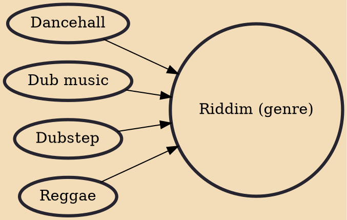

Riddim is a subgenre of dubstep known for its heavy use of repetitive and minimalist sub-bass and triplet percussion arrangements. It shares the same name as the Jamaican genre that influenced both it and dubstep, which originally derived from dub, reggae, and dancehall. Originating in the United Kingdom, specifically Croydon, in the early 2010s as a resurgence of the style used by early dubstep works, riddim had started to gain mainstream presence in the electronic music scene around 2015.

## Influences
- [[Dancehall]]
- [[Dub music]]
- [[Dubstep]]
- [[Reggae]]
