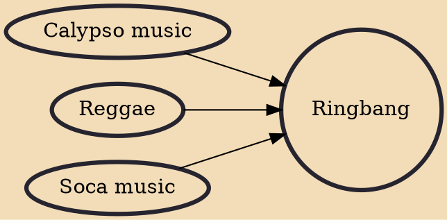

Ringbang is variously a Caribbean fusion of music genres, a philosophy, and an aesthetic propounded by Eddy Grant in 1994. In an interview circa 2000, Grant defined ringbang like this: Ringbang is the thing that makes the soul quiet. That in a musical concept is rhythm. A child is given ringbang when a mother rocks it in her arms. Ringbang allowed the slaves to communicate. Ringbang is a bridge that allows us to stop being insular; it is a concept predicated on our being able to communicate with one another.

## Influences
- [[Calypso music]]
- [[Reggae]]
- [[Soca music]]
