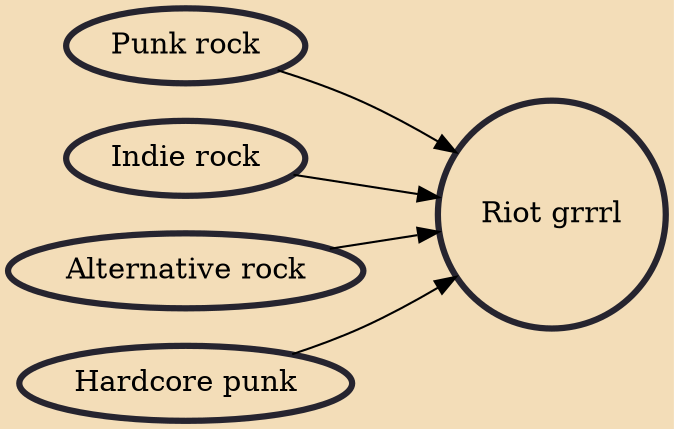

Riot grrrl is an underground feminist punk movement that began during the early 1990s within the United States in Olympia, Washington and the greater Pacific Northwest and has expanded to at least 26 other countries. Riot grrrl is a subcultural movement that combines feminism, punk music, and politics. It is often associated with third-wave feminism, which is sometimes seen as having grown out of the riot grrrl movement and has recently been seen in fourth-wave feminist punk music that rose in the 2010s. The genre has also been described as coming out of indie rock, with the punk scene serving as an inspiration for a movement in which women could express anger, rage, and frustration, emotions considered socially acceptable for male songwriters but less common for women.

## Influences

- [[Punk rock]]
- [[Indie rock]]
- [[Alternative rock]]
- [[Hardcore punk]]
