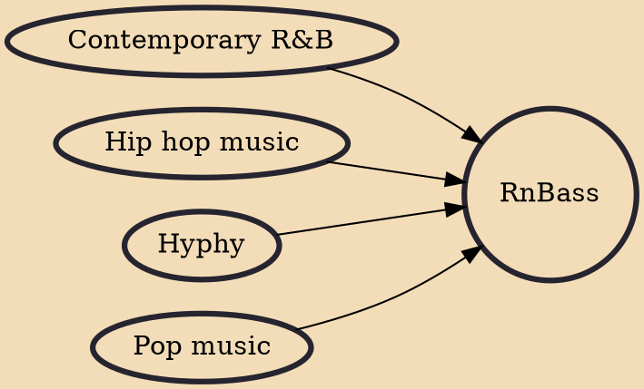

RnBass (also spelled as R&Bass, shortening of rhythm and bass) is a music genre that fuses contemporary R&B music with hip hop production style or music genre, known as ratchet music, coined by DJ Mustard. Described by Vibe magazine as a breath of fresh air for the R&B genre, RnBass consists of tonal singing, melodic harmonies, along with heavy 808's bass elements. There are also notable elements of EDM, with influences of 1990s–2000s music, as well as hyphy. Coined by Bay Area producer J Maine, the RnBass musical style has garnered critical attention since the early-to-mid 2010s and has been popularized with urban audiences across America by Los Angeles producer DJ Mustard, by mixing pop music elements of ratchet with turn-up lyrics. Despite originating in the West Coast, namely the Bay A

## Influences
- [[Contemporary R&B]]
- [[Hip hop music]]
- [[Hyphy]]
- [[Pop music]]
