```dot
digraph {
	graph [bgcolor="#F3DDB8" rankdir=LR]
	node [color="#26242F" penwidth=3.0]
	"Rock and roll" [shape=circle]
	"Americana (music)" [URL="/americana-music/"]
	"Americana (music)" -> "Rock and roll"
	"Electric blues" [URL="/electric-blues/"]
	"Electric blues" -> "Rock and roll"
	Blues [URL="/blues/"]
	Blues -> "Rock and roll"
	"Rhythm and blues" [URL="/rhythm-and-blues/"]
	"Rhythm and blues" -> "Rock and roll"
	"African blues" [URL="/african-blues/"]
	"African blues" -> "Rock and roll"
	"Gospel music" [URL="/gospel-music/"]
	"Gospel music" -> "Rock and roll"
	Jazz [URL="/jazz/"]
	Jazz -> "Rock and roll"
	"Country music" [URL="/country-music/"]
	"Country music" -> "Rock and roll"
	"Boogie-woogie" [URL="/boogie-woogie/"]
	"Boogie-woogie" -> "Rock and roll"
	"Chilean rock" [URL="/chilean-rock/"]
	"Rock and roll" -> "Chilean rock"
	"British rock and roll" [URL="/british-rock-and-roll/"]
	"Rock and roll" -> "British rock and roll"
	"Biker metal" [URL="/biker-metal/"]
	"Rock and roll" -> "Biker metal"
	Freakbeat [URL="/freakbeat/"]
	"Rock and roll" -> Freakbeat
	"Pop music" [URL="/pop-music/"]
	"Rock and roll" -> "Pop music"
	"Southern rock" [URL="/southern-rock/"]
	"Rock and roll" -> "Southern rock"
	"Armenian rock" [URL="/armenian-rock/"]
	"Rock and roll" -> "Armenian rock"
	Kaseko [URL="/kaseko/"]
	"Rock and roll" -> Kaseko
	"Bangladeshi rock" [URL="/bangladeshi-rock/"]
	"Rock and roll" -> "Bangladeshi rock"
	"Schlager music" [URL="/schlager-music/"]
	"Rock and roll" -> "Schlager music"
	"Iranian rock" [URL="/iranian-rock/"]
	"Rock and roll" -> "Iranian rock"
	"Tulsa sound" [URL="/tulsa-sound/"]
	"Rock and roll" -> "Tulsa sound"
	Rockabilly [URL="/rockabilly/"]
	"Rock and roll" -> Rockabilly
	"New Mexico music" [URL="/new-mexico-music/"]
	"Rock and roll" -> "New Mexico music"
	"Glam rock" [URL="/glam-rock/"]
	"Rock and roll" -> "Glam rock"
	"Outlaw country" [URL="/outlaw-country/"]
	"Rock and roll" -> "Outlaw country"
	Jit [URL="/jit/"]
	"Rock and roll" -> Jit
	"Trønder rock" [URL="/tronder-rock/"]
	"Rock and roll" -> "Trønder rock"
	"Surf music" [URL="/surf-music/"]
	"Rock and roll" -> "Surf music"
	"Nueva ola" [URL="/nueva-ola/"]
	"Rock and roll" -> "Nueva ola"
	"Heartland rock" [URL="/heartland-rock/"]
	"Rock and roll" -> "Heartland rock"
	"Rock music in Australia" [URL="/rock-music-in-australia/"]
	"Rock and roll" -> "Rock music in Australia"
	"Brill Building (genre)" [URL="/brill-building-genre/"]
	"Rock and roll" -> "Brill Building (genre)"
	"Yé-yé" [URL="/ye-ye/"]
	"Rock and roll" -> "Yé-yé"
	"Neue Volksmusik" [URL="/neue-volksmusik/"]
	"Rock and roll" -> "Neue Volksmusik"
	"French pop music" [URL="/french-pop-music/"]
	"Rock and roll" -> "French pop music"
	"Swamp pop" [URL="/swamp-pop/"]
	"Rock and roll" -> "Swamp pop"
	Indorock [URL="/indorock/"]
	"Rock and roll" -> Indorock
	"Hard rock" [URL="/hard-rock/"]
	"Rock and roll" -> "Hard rock"
	"Brazilian rock" [URL="/brazilian-rock/"]
	"Rock and roll" -> "Brazilian rock"
	"Indonesian rock" [URL="/indonesian-rock/"]
	"Rock and roll" -> "Indonesian rock"
	"Rock music of West Bengal" [URL="/rock-music-of-west-bengal/"]
	"Rock and roll" -> "Rock music of West Bengal"
	"Garage rock" [URL="/garage-rock/"]
	"Rock and roll" -> "Garage rock"
	"Rock music in Ireland" [URL="/rock-music-in-ireland/"]
	"Rock and roll" -> "Rock music in Ireland"
	"Rock music in Greece" [URL="/rock-music-in-greece/"]
	"Rock and roll" -> "Rock music in Greece"
	"Rock music in Slovenia" [URL="/rock-music-in-slovenia/"]
	"Rock and roll" -> "Rock music in Slovenia"
	"Rock music in New Zealand" [URL="/rock-music-in-new-zealand/"]
	"Rock and roll" -> "Rock music in New Zealand"
	"Brisbane punk rock" [URL="/brisbane-punk-rock/"]
	"Rock and roll" -> "Brisbane punk rock"
	"Kayōkyoku" [URL="/kayokyoku/"]
	"Rock and roll" -> "Kayōkyoku"
	"Car song" [URL="/car-song/"]
	"Rock and roll" -> "Car song"
	"Al Jeel" [URL="/al-jeel/"]
	"Rock and roll" -> "Al Jeel"
	Rasin [URL="/rasin/"]
	"Rock and roll" -> Rasin
	"Group sounds" [URL="/group-sounds/"]
	"Rock and roll" -> "Group sounds"
	"Bakersfield sound" [URL="/bakersfield-sound/"]
	"Rock and roll" -> "Bakersfield sound"
	"Manila sound" [URL="/manila-sound/"]
	"Rock and roll" -> "Manila sound"
	"Boogie rock" [URL="/boogie-rock/"]
	"Rock and roll" -> "Boogie rock"
	"Death 'n' roll" [URL="/death-n-roll/"]
	"Rock and roll" -> "Death 'n' roll"
	"Pub rock (United Kingdom)" [URL="/pub-rock-united-kingdom/"]
	"Rock and roll" -> "Pub rock (United Kingdom)"
	"Rock music" [URL="/rock-music/"]
	"Rock and roll" -> "Rock music"
	Dansband [URL="/dansband/"]
	"Rock and roll" -> Dansband
	"Punk rock" [URL="/punk-rock/"]
	"Rock and roll" -> "Punk rock"
	"Uruguayan rock" [URL="/uruguayan-rock/"]
	"Rock and roll" -> "Uruguayan rock"
}
```

Rock and roll (often written as rock & roll, rock 'n' roll, or rock 'n roll) is a genre of popular music that evolved in the United States during the late 1940s and early 1950s. It originated from African-American music such as jazz, rhythm and blues, boogie woogie, and gospel, as well as country music. While rock and roll's formative elements can be heard in blues records from the 1920s and in country records of the 1930s, the genre did not acquire its name until 1954.

## Influences
- [[Americana (music)]]
- [[Electric blues]]
- [[Blues]]
- [[Rhythm and blues]]
- [[African blues]]
- [[Gospel music]]
- [[Jazz]]
- [[Country music]]
- [[Boogie-woogie]]

## Derivatives
- [[Chilean rock]]
- [[British rock and roll]]
- [[Biker metal]]
- [[Freakbeat]]
- [[Pop music]]
- [[Southern rock]]
- [[Armenian rock]]
- [[Kaseko]]
- [[Bangladeshi rock]]
- [[Schlager music]]
- [[Iranian rock]]
- [[Tulsa sound]]
- [[Rockabilly]]
- [[New Mexico music]]
- [[Glam rock]]
- [[Outlaw country]]
- [[Jit]]
- [[Trønder rock]]
- [[Surf music]]
- [[Nueva ola]]
- [[Heartland rock]]
- [[Rock music in Australia]]
- [[Brill Building (genre)]]
- [[Yé-yé]]
- [[Neue Volksmusik]]
- [[French pop music]]
- [[Swamp pop]]
- [[Indorock]]
- [[Hard rock]]
- [[Brazilian rock]]
- [[Indonesian rock]]
- [[Rock music of West Bengal]]
- [[Garage rock]]
- [[Rock music in Ireland]]
- [[Rock music in Greece]]
- [[Rock music in Slovenia]]
- [[Rock music in New Zealand]]
- [[Brisbane punk rock]]
- [[Kayōkyoku]]
- [[Car song]]
- [[Al Jeel]]
- [[Rasin]]
- [[Group sounds]]
- [[Bakersfield sound]]
- [[Manila sound]]
- [[Boogie rock]]
- [[Death 'n' roll]]
- [[Pub rock (United Kingdom)]]
- [[Rock music]]
- [[Dansband]]
- [[Punk rock]]
- [[Uruguayan rock]]
