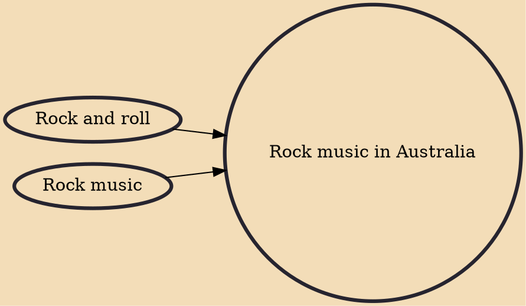

Rock music in Australia, also known as Oz rock, Australian rock and Aussie rock, is rock music from Australia. The nation has a rich history of rock music and an appreciation of the roots of various rock genres, usually originating in the United States or Britain, but also continental Europe, and more recently the musical styles of Africa. Australian rock has also contributed to the development of some of these genres, as well as having its own unique Australiana sound with pub rock and its indigenous music.

## Influences

- [[Rock and roll]]
- [[Rock music]]
