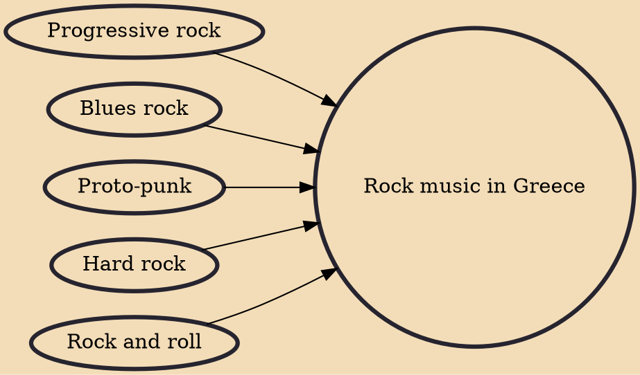

Rock and roll entered Greece in the middle of the 1960s. Greek rock performers in the field include Pavlos Sidiropoulos, Dimitris Poulikakos.Greek rock bands well known globally are Aphrodite's Child, Socrates Drank the Conium and The Last Drive.

## Influences

- [[Progressive rock]]
- [[Blues rock]]
- [[Proto-punk]]
- [[Hard rock]]
- [[Rock and roll]]
