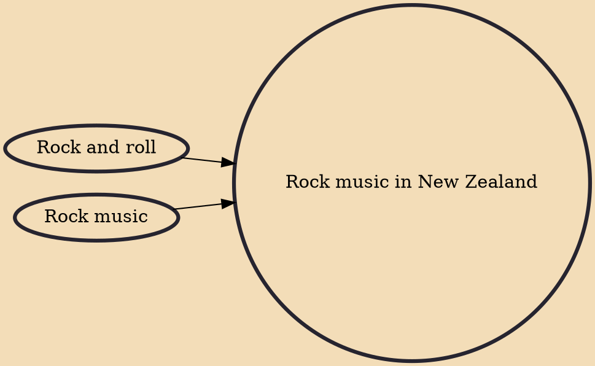

Rock music in New Zealand, also known as Kiwi rock music and New Zealand rock music, rose to prominence first in 1955 with 's cover version of Bill Haley's hit song "Rock Around the Clock". This was followed by Johnny Devlin, sometimes nicknamed New Zealand's Elvis Presley, and his cover of "Lawdy Miss Clawdy". The 1960s saw Max Merritt and the Meteors and Ray Columbus & the Invaders achieve success. In the 1970s and early 1980s the innovative Split Enz had success internationally as well as nationally, with member Neil Finn later continuing with Crowded House. Other influential bands in the 1970s were Th' Dudes, Dragon and Hello Sailor. The early 1980s saw the development of the indie rock "Dunedin sound", typified by Dunedin bands such as The Clean, Straitjacket Fits and The Chills, reco

## Influences

- [[Rock and roll]]
- [[Rock music]]
