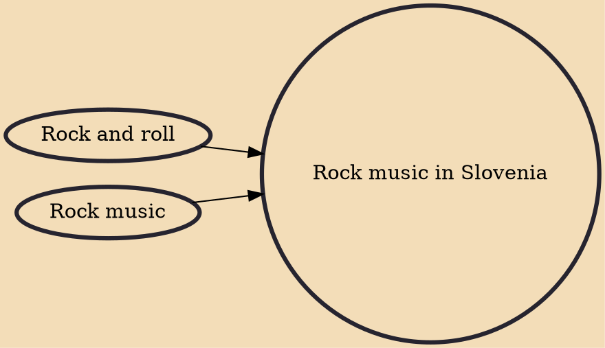

Rock and roll is a musical genre from the United States, popularized worldwide beginning in the 1950s. Though rock had become popular earlier, it was not until the mid-1980s breakthrough of Laibach, who are now internationally renowned, that Slovenian rock became well-known. Other well-known Slovenian rock bands include , whose 1998 tour of the United States brought even more international attention to Slovenian rock. In Yugoslavia, Slovenia was the center for punk rock. The best-known representatives of this genre were Pankrti, Niet, , , , , and .

## Influences
- [[Rock and roll]]
- [[Rock music]]
