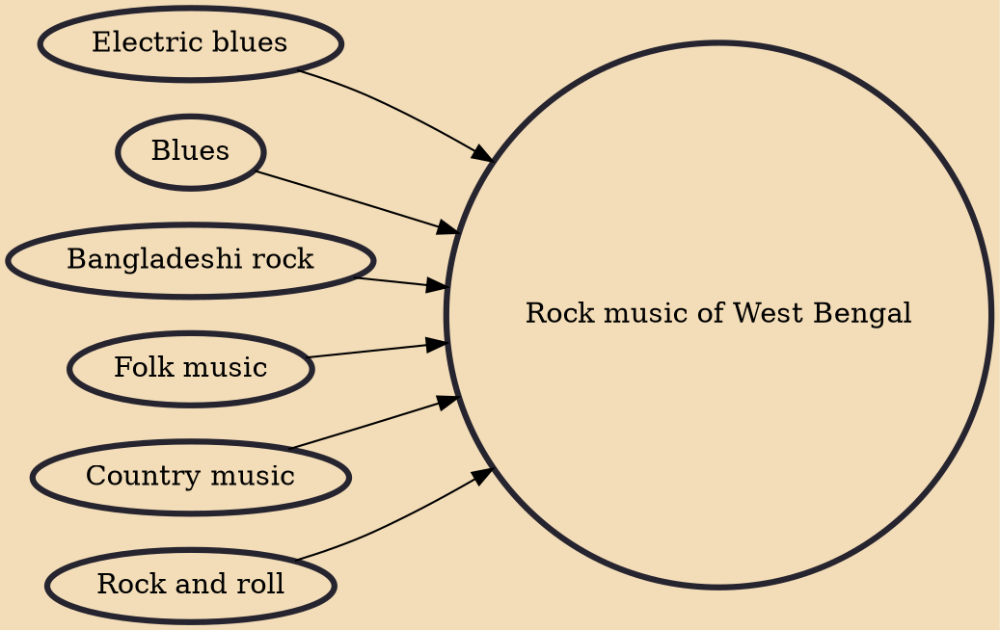

Rock music of West Bengal originated in Kolkata, West Bengal, India. The first Bengali rock band in West Bengal and India was Moheener Ghoraguli. In modern times, in this type of music distorted electric guitars, bass guitar, and drums are used, sometimes accompanied with pianos and keyboards. In early times the instruments used in modern times were also accompanied by saxophone, flute, violin and bass violin.

## Influences
- [[Electric blues]]
- [[Blues]]
- [[Bangladeshi rock]]
- [[Folk music]]
- [[Country music]]
- [[Rock and roll]]
