```dot
digraph {
	graph [bgcolor="#F3DDB8" rankdir=LR]
	node [color="#26242F" penwidth=3.0]
	"Rock music" [shape=circle]
	"Electric blues" [URL="/electric-blues/"]
	"Electric blues" -> "Rock music"
	Blues [URL="/blues/"]
	Blues -> "Rock music"
	"Rhythm and blues" [URL="/rhythm-and-blues/"]
	"Rhythm and blues" -> "Rock music"
	"Folk music" [URL="/folk-music/"]
	"Folk music" -> "Rock music"
	Jazz [URL="/jazz/"]
	Jazz -> "Rock music"
	"Country music" [URL="/country-music/"]
	"Country music" -> "Rock music"
	"Rock and roll" [URL="/rock-and-roll/"]
	"Rock and roll" -> "Rock music"
	"Soul music" [URL="/soul-music/"]
	"Soul music" -> "Rock music"
	Rockabilly [URL="/rockabilly/"]
	Rockabilly -> "Rock music"
	Rebetiko [URL="/rebetiko/"]
	"Rock music" -> Rebetiko
	"Chamber pop" [URL="/chamber-pop/"]
	"Rock music" -> "Chamber pop"
	"San Francisco sound" [URL="/san-francisco-sound/"]
	"Rock music" -> "San Francisco sound"
	Freakbeat [URL="/freakbeat/"]
	"Rock music" -> Freakbeat
	"Orthodox pop music" [URL="/orthodox-pop-music/"]
	"Rock music" -> "Orthodox pop music"
	"Comedy rock" [URL="/comedy-rock/"]
	"Rock music" -> "Comedy rock"
	"Baroque pop" [URL="/baroque-pop/"]
	"Rock music" -> "Baroque pop"
	"British folk rock" [URL="/british-folk-rock/"]
	"Rock music" -> "British folk rock"
	"Country rock" [URL="/country-rock/"]
	"Rock music" -> "Country rock"
	"Proto-prog" [URL="/proto-prog/"]
	"Rock music" -> "Proto-prog"
	Austropop [URL="/austropop/"]
	"Rock music" -> Austropop
	"Blues rock" [URL="/blues-rock/"]
	"Rock music" -> "Blues rock"
	Palingsound [URL="/palingsound/"]
	"Rock music" -> Palingsound
	"Funk rock" [URL="/funk-rock/"]
	"Rock music" -> "Funk rock"
	"Iranian rock" [URL="/iranian-rock/"]
	"Rock music" -> "Iranian rock"
	"Reggae fusion" [URL="/reggae-fusion/"]
	"Rock music" -> "Reggae fusion"
	"K-pop" [URL="/k-pop/"]
	"Rock music" -> "K-pop"
	"Roots rock" [URL="/roots-rock/"]
	"Rock music" -> "Roots rock"
	"Canterbury scene" [URL="/canterbury-scene/"]
	"Rock music" -> "Canterbury scene"
	"Medieval folk rock" [URL="/medieval-folk-rock/"]
	"Rock music" -> "Medieval folk rock"
	"V-pop" [URL="/v-pop/"]
	"Rock music" -> "V-pop"
	Eurodisco [URL="/eurodisco/"]
	"Rock music" -> Eurodisco
	"Música popular brasileira" [URL="/musica-popular-brasileira/"]
	"Rock music" -> "Música popular brasileira"
	"Rap rock" [URL="/rap-rock/"]
	"Rock music" -> "Rap rock"
	"New Mexico music" [URL="/new-mexico-music/"]
	"Rock music" -> "New Mexico music"
	"Teen pop" [URL="/teen-pop/"]
	"Rock music" -> "Teen pop"
	"Instrumental rock" [URL="/instrumental-rock/"]
	"Rock music" -> "Instrumental rock"
	"Post-progressive" [URL="/post-progressive/"]
	"Rock music" -> "Post-progressive"
	Nederpop [URL="/nederpop/"]
	"Rock music" -> Nederpop
	"Flamenco rock" [URL="/flamenco-rock/"]
	"Rock music" -> "Flamenco rock"
	"Rock music in Australia" [URL="/rock-music-in-australia/"]
	"Rock music" -> "Rock music in Australia"
	"Progressive rock" [URL="/progressive-rock/"]
	"Rock music" -> "Progressive rock"
	"Progressive rap" [URL="/progressive-rap/"]
	"Rock music" -> "Progressive rap"
	"Progressive pop" [URL="/progressive-pop/"]
	"Rock music" -> "Progressive pop"
	"Country pop" [URL="/country-pop/"]
	"Rock music" -> "Country pop"
	"Folk rock" [URL="/folk-rock/"]
	"Rock music" -> "Folk rock"
	"New flamenco" [URL="/new-flamenco/"]
	"Rock music" -> "New flamenco"
	"Thai pop music" [URL="/thai-pop-music/"]
	"Rock music" -> "Thai pop music"
	"Mashup (music)" [URL="/mashup-music/"]
	"Rock music" -> "Mashup (music)"
	"Sufi rock" [URL="/sufi-rock/"]
	"Rock music" -> "Sufi rock"
	"Experimental rock" [URL="/experimental-rock/"]
	"Rock music" -> "Experimental rock"
	"Desert blues" [URL="/desert-blues/"]
	"Rock music" -> "Desert blues"
	"Industrial rock" [URL="/industrial-rock/"]
	"Rock music" -> "Industrial rock"
	"Tejano music" [URL="/tejano-music/"]
	"Rock music" -> "Tejano music"
	"Bubblegum music" [URL="/bubblegum-music/"]
	"Rock music" -> "Bubblegum music"
	"Brazilian rock" [URL="/brazilian-rock/"]
	"Rock music" -> "Brazilian rock"
	"Christian rock" [URL="/christian-rock/"]
	"Rock music" -> "Christian rock"
	"Indonesian rock" [URL="/indonesian-rock/"]
	"Rock music" -> "Indonesian rock"
	"Rock music in Ireland" [URL="/rock-music-in-ireland/"]
	"Rock music" -> "Rock music in Ireland"
	"Rock music in New Zealand" [URL="/rock-music-in-new-zealand/"]
	"Rock music" -> "Rock music in New Zealand"
	"Rock music in Slovenia" [URL="/rock-music-in-slovenia/"]
	"Rock music" -> "Rock music in Slovenia"
	"Pinoy rock" [URL="/pinoy-rock/"]
	"Rock music" -> "Pinoy rock"
	Mandopop [URL="/mandopop/"]
	"Rock music" -> Mandopop
	"Car song" [URL="/car-song/"]
	"Rock music" -> "Car song"
	"Jazz fusion" [URL="/jazz-fusion/"]
	"Rock music" -> "Jazz fusion"
	"Shock rock" [URL="/shock-rock/"]
	"Rock music" -> "Shock rock"
	"Samba rock" [URL="/samba-rock/"]
	"Rock music" -> "Samba rock"
	"Celtic rock" [URL="/celtic-rock/"]
	"Rock music" -> "Celtic rock"
	"Phleng phuea chiwit" [URL="/phleng-phuea-chiwit/"]
	"Rock music" -> "Phleng phuea chiwit"
	"Alternative hip hop" [URL="/alternative-hip-hop/"]
	"Rock music" -> "Alternative hip hop"
	"Psychedelic rock" [URL="/psychedelic-rock/"]
	"Rock music" -> "Psychedelic rock"
	"Turbo-folk" [URL="/turbo-folk/"]
	"Rock music" -> "Turbo-folk"
	Worldbeat [URL="/worldbeat/"]
	"Rock music" -> Worldbeat
	Schaffel [URL="/schaffel/"]
	"Rock music" -> Schaffel
	"Electronic rock" [URL="/electronic-rock/"]
	"Rock music" -> "Electronic rock"
	"Jewish rock" [URL="/jewish-rock/"]
	"Rock music" -> "Jewish rock"
	Zamrock [URL="/zamrock/"]
	"Rock music" -> Zamrock
	"Zhongguo feng (music)" [URL="/zhongguo-feng-music/"]
	"Rock music" -> "Zhongguo feng (music)"
}
```

Rock music is a broad genre of popular music that originated as "rock and roll" in the United States in the late 1940s and early 1950s, developing into a range of different styles in the mid-1960s and later, particularly in the United States and United Kingdom. It has its roots in 1940s and 1950s rock and roll, a style that drew directly from the blues and rhythm and blues genres of African-American music and from country music. Rock also drew strongly from a number of other genres such as electric blues and folk, and incorporated influences from jazz, classical, and other musical styles. For instrumentation, rock has centered on the electric guitar, usually as part of a rock group with electric bass guitar, drums, and one or more singers. Usually, rock is song-based music with a 44 time s

## Influences
- [[Electric blues]]
- [[Blues]]
- [[Rhythm and blues]]
- [[Folk music]]
- [[Jazz]]
- [[Country music]]
- [[Rock and roll]]
- [[Soul music]]
- [[Rockabilly]]

## Derivatives
- [[Rebetiko]]
- [[Chamber pop]]
- [[San Francisco sound]]
- [[Freakbeat]]
- [[Orthodox pop music]]
- [[Comedy rock]]
- [[Baroque pop]]
- [[British folk rock]]
- [[Country rock]]
- [[Proto-prog]]
- [[Austropop]]
- [[Blues rock]]
- [[Palingsound]]
- [[Funk rock]]
- [[Iranian rock]]
- [[Reggae fusion]]
- [[K-pop]]
- [[Roots rock]]
- [[Canterbury scene]]
- [[Medieval folk rock]]
- [[V-pop]]
- [[Eurodisco]]
- [[Música popular brasileira]]
- [[Rap rock]]
- [[New Mexico music]]
- [[Teen pop]]
- [[Instrumental rock]]
- [[Post-progressive]]
- [[Nederpop]]
- [[Flamenco rock]]
- [[Rock music in Australia]]
- [[Progressive rock]]
- [[Progressive rap]]
- [[Progressive pop]]
- [[Country pop]]
- [[Folk rock]]
- [[New flamenco]]
- [[Thai pop music]]
- [[Mashup (music)]]
- [[Sufi rock]]
- [[Experimental rock]]
- [[Desert blues]]
- [[Industrial rock]]
- [[Tejano music]]
- [[Bubblegum music]]
- [[Brazilian rock]]
- [[Christian rock]]
- [[Indonesian rock]]
- [[Rock music in Ireland]]
- [[Rock music in New Zealand]]
- [[Rock music in Slovenia]]
- [[Pinoy rock]]
- [[Mandopop]]
- [[Car song]]
- [[Jazz fusion]]
- [[Shock rock]]
- [[Samba rock]]
- [[Celtic rock]]
- [[Phleng phuea chiwit]]
- [[Alternative hip hop]]
- [[Psychedelic rock]]
- [[Turbo-folk]]
- [[Worldbeat]]
- [[Schaffel]]
- [[Electronic rock]]
- [[Jewish rock]]
- [[Zamrock]]
- [[Zhongguo feng (music)]]
