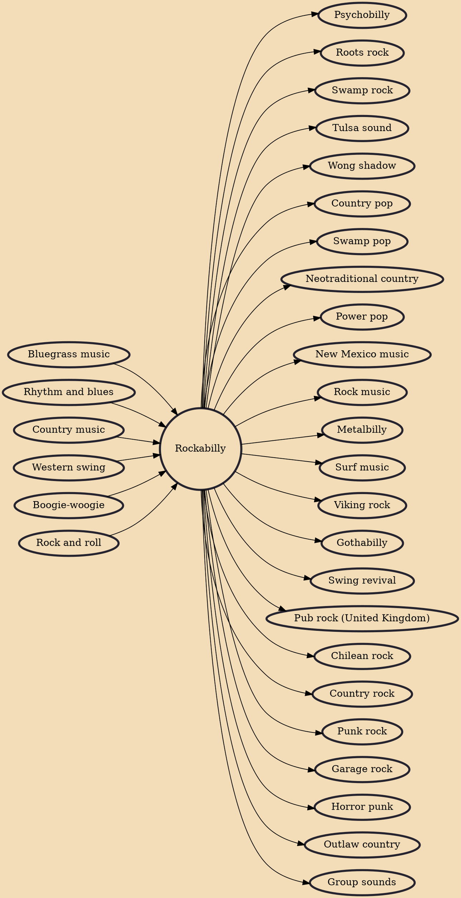

Rockabilly is one of the earliest styles of rock and roll music. It dates back to the early 1950s in the United States, especially the South. As a genre it blends the sound of Western musical styles such as country with that of rhythm and blues, leading to what is considered "classic" rock and roll. Some have also described it as a blend of bluegrass with rock and roll. The term "rockabilly" itself is a portmanteau of "rock" (from "rock 'n' roll") and "hillbilly", the latter a reference to the country music (often called "hillbilly music" in the 1940s and 1950s) that contributed strongly to the style. Other important influences on rockabilly include western swing, boogie-woogie, jump blues, and electric blues.

## Influences
- [[Bluegrass music]]
- [[Rhythm and blues]]
- [[Country music]]
- [[Western swing]]
- [[Boogie-woogie]]
- [[Rock and roll]]

## Derivatives
- [[Psychobilly]]
- [[Roots rock]]
- [[Swamp rock]]
- [[Tulsa sound]]
- [[Wong shadow]]
- [[Country pop]]
- [[Swamp pop]]
- [[Neotraditional country]]
- [[Power pop]]
- [[New Mexico music]]
- [[Rock music]]
- [[Metalbilly]]
- [[Surf music]]
- [[Viking rock]]
- [[Gothabilly]]
- [[Swing revival]]
- [[Pub rock (United Kingdom)]]
- [[Chilean rock]]
- [[Country rock]]
- [[Punk rock]]
- [[Garage rock]]
- [[Horror punk]]
- [[Outlaw country]]
- [[Group sounds]]
