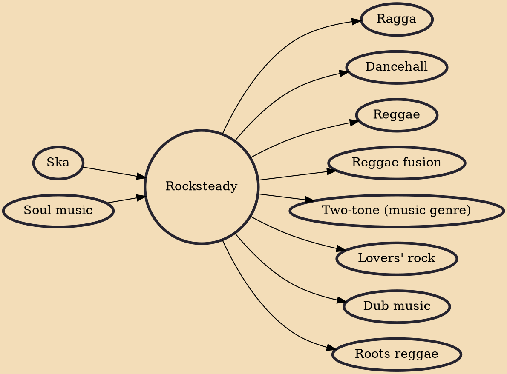

Rocksteady is a music genre that originated in Jamaica around 1966. A successor of ska and a precursor to reggae, rocksteady was the dominant style of music in Jamaica for nearly two years, performed by many of the artists who helped establish reggae, including harmony groups such as the Techniques, the Paragons, the Heptones and the Gaylads; soulful singers such as Alton Ellis, Delroy Wilson, Bob Andy, Ken Boothe and Phyllis Dillon; musicians such as Jackie Mittoo, Lynn Taitt and Tommy McCook. The term rocksteady comes from a popular (slower) dance style mentioned in the Alton Ellis song "Rocksteady", that matched the new sound. Some rocksteady songs became hits outside Jamaica, as with ska, helping to secure the international base reggae music has today.

## Influences

- [[Ska]]
- [[Soul music]]

## Derivatives

- [[Ragga]]
- [[Dancehall]]
- [[Reggae]]
- [[Reggae fusion]]
- [[Two-tone (music genre)]]
- [[Lovers' rock]]
- [[Dub music]]
- [[Roots reggae]]
