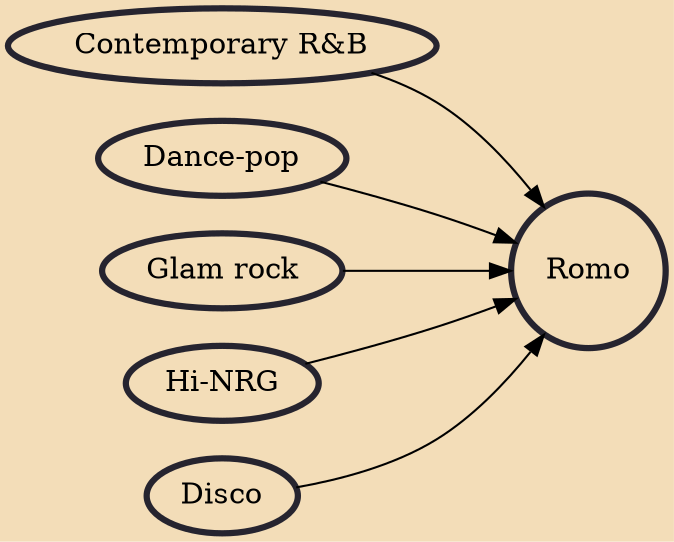

Romantic Modernism, more commonly known as Romo, was a musical and nightclubbing movement, of glam/style pop lineage, in the UK circa 1995–1997, centred on the twin homes of Camden-based clubnight Club Skinny and its West End clone Arcadia, as well as concerts by the chief associated bands.

## Influences
- [[Contemporary R&B]]
- [[Dance-pop]]
- [[Glam rock]]
- [[Hi-NRG]]
- [[Disco]]
