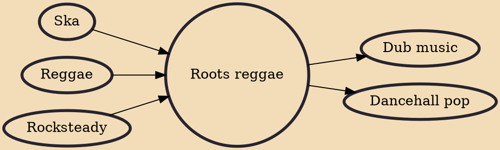

Roots reggae is a subgenre of reggae that deals with the everyday lives and aspirations of Africans and those in the African Diaspora, including the spiritual side of Rastafari, black liberation, revolution and the honoring of God, called Jah by Rastafarians. It is identified with the life of the ghetto sufferer, and the rural poor. Lyrical themes include spirituality and religion, struggles by artists, poverty, black pride, social issues, resistance to fascism, capitalism, corrupt government and racial oppression. A spiritual repatriation to Africa is a common theme in roots reggae.

## Influences

- [[Ska]]
- [[Reggae]]
- [[Rocksteady]]

## Derivatives

- [[Dub music]]
- [[Dancehall pop]]
