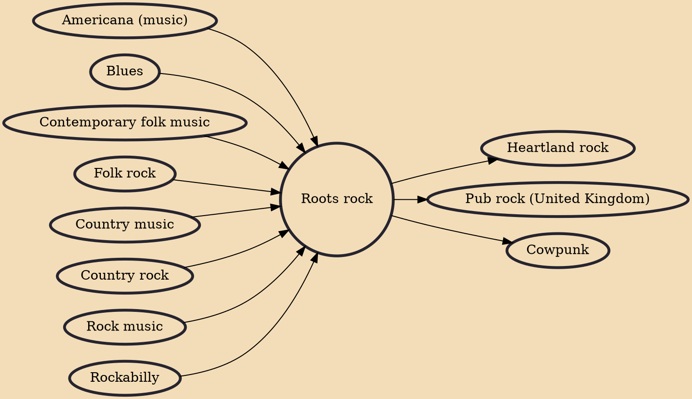

Roots rock is a genre of rock music that looks back to rock's origins in folk, blues and country music. It is particularly associated with the creation of hybrid subgenres from the later 1960s including blues rock, country rock, Southern rock, and swamp rock which have been seen as responses to the perceived excesses of dominant psychedelic and developing progressive rock. Because roots music (Americana) is often used to mean folk and world musical forms, roots rock is sometimes used in a broad sense to describe any rock music that incorporates elements of this music. In the 1980s, roots rock enjoyed a revival in response to trends in punk rock, new wave, and heavy metal music.

## Influences

- [[Americana (music)]]
- [[Blues]]
- [[Contemporary folk music]]
- [[Folk rock]]
- [[Country music]]
- [[Country rock]]
- [[Rock music]]
- [[Rockabilly]]

## Derivatives

- [[Heartland rock]]
- [[Pub rock (United Kingdom)]]
- [[Cowpunk]]
