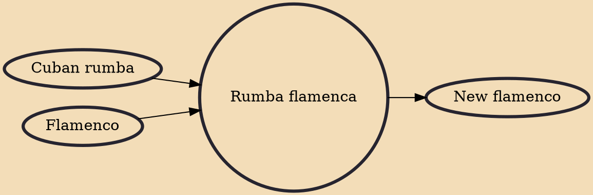

Rumba flamenca, also known as flamenco rumba or simply rumba (Spanish pronunciation: [ˈrumba]), is a palo (style) of flamenco music developed in Andalusia, Spain. It is known as one of the cantes de ida y vuelta (roundtrip songs), music which diverged in the new world, then returned to Spain in a new form. The genre originated in the 19th century in Andalusia, southern Spain, where Cuban music first reached the country.

## Influences

- [[Cuban rumba]]
- [[Flamenco]]

## Derivatives

- [[New flamenco]]
