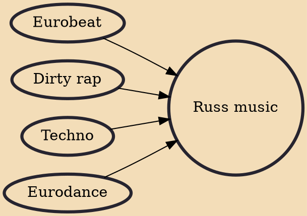

Russ music (Norwegian: russemusikk) is a subgenre of electronic dance music and a music scene which originated from Norway during the mid-2000s. Drawing inspiration from EDM, hip hop and techno. Russ music is characterized by its fast tempo, synthesizers, notable bass and explicit lyrics, often combined with rapping. Usually, this type of music are produced on request by Norwegian high school graduates to promote their "russ concept" as a part of the russ celebration.

## Influences
- [[Eurobeat]]
- [[Dirty rap]]
- [[Techno]]
- [[Eurodance]]
