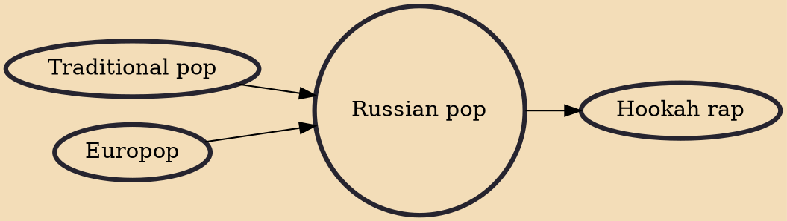

Russian pop music is Russian language pop music produced either in Russia, CIS countries, Baltic states and other foreign countries in which the songs are performed primarily in Russian language, languages of the countries of the CIS, and in the other languages of the world. This is the successor to popular "variety" Soviet music with its pop idols such as Alla Pugacheva or Valery Leontiev.

## Influences
- [[Traditional pop]]
- [[Europop]]

## Derivatives
- [[Hookah rap]]
