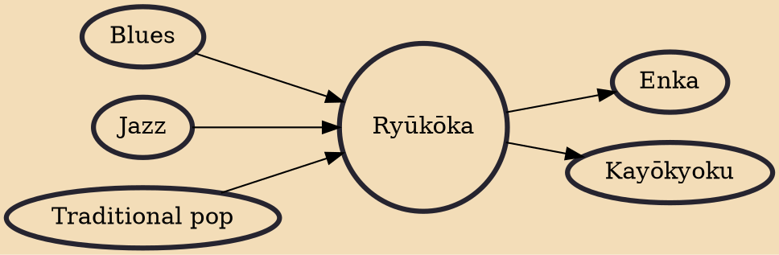

Ryūkōka (流行歌, literally "Popular Song") is a Japanese musical genre. The term originally denoted any kind of "popular music" in Japanese, and is the sinic reading of hayariuta, used for commercial music of Edo Period. Therefore, imayō, which was promoted by Emperor Go-Shirakawa in the Heian period, was a kind of ryūkōka. Today, however, ryūkōka refers specifically to Japanese popular music from the late 1920s through the early 1960s. Some of the roots of ryūkōka were developed from Western classical music. Ryūkōka ultimately split into two genres: enka and poppusu. Unlike enka, archetypal ryūkōka songs did not use the kobushi method of singing. Ryūkōka used legato. Bin Uehara and Yoshio Tabata are considered to be among the founders of the modern style of kobushi singing.

## Influences
- [[Blues]]
- [[Jazz]]
- [[Traditional pop]]

## Derivatives
- [[Enka]]
- [[Kayōkyoku]]
