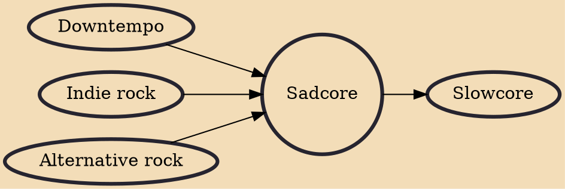

Sadcore is a subgenre occasionally identified by music journalists to describe examples of alternative rock characterised by bleak lyrics, downbeat melodies and slower tempos, or alternatively, songs with deceivingly upbeat melodies that are simultaneously characterised by depressive lyrical undertones or imagery. It is a loose definition and does not describe a specific movement, group or scene. It is categorised by AllMusic's reference guide as music "by and for the depressed". Sadcore is sometimes considered synonymous with the term slowcore, and both share the distinction of often being dismissed as a label by the bands they would describe.

## Influences
- [[Downtempo]]
- [[Indie rock]]
- [[Alternative rock]]

## Derivatives
- [[Slowcore]]
