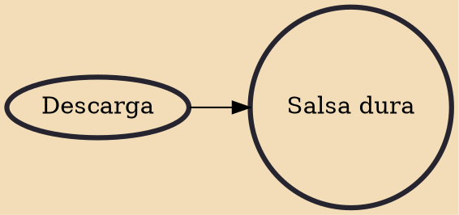

Salsa dura, also known as salsa brava or salsa gorda, is a style of salsa music developed in the 1970s with an emphasis on the instrumental part of the music (piano, bass, horns, percussion, etc.) over the lead vocals. The genre originated in New York City where large ensembles such as Fania All-Stars adapted the salsa genre to a descarga format. Modern salsa dura bands include Orquesta SCC, Spanish Harlem Orchestra, Wayne Gorbea, Oscar D'Leon, , Jimmy Bosch, La Maxima 79, Tromboranga, and Orquesta La 33. The term is often used in contrast to salsa romántica, the Latin pop-oriented subgenre of salsa that has predominated since the late 1980s.

## Influences
- [[Descarga]]
