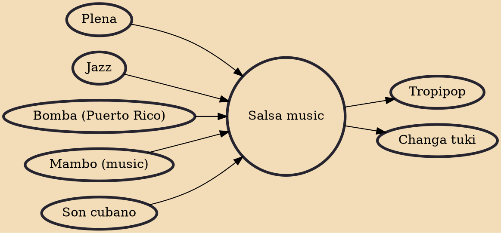

Salsa music is a style of Latin American music. Because most of the basic musical components predate the labeling of salsa, there have been many controversies regarding its origin. Most songs considered as salsa are primarily based on son montuno, with elements of mambo, Latin jazz, bomba, plena and guaracha. All of these elements are adapted to fit the basic son montuno template when performed within the context of salsa.

## Influences

- [[Plena]]
- [[Jazz]]
- [[Bomba (Puerto Rico)]]
- [[Mambo (music)]]
- [[Son cubano]]

## Derivatives

- [[Tropipop]]
- [[Changa tuki]]
