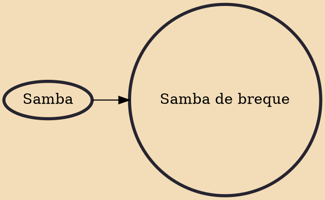

Samba de breque is a subgenre of samba that emerged in Rio de Janeiro between the late 1930s and early 1940s. The main characteristic of the subgenre is "breque", a Brazilian term for "brake". In other words, it is a samba with sudden stops, usually of a humorous character, in which the singer makes spoken comments. The singer Moreira da Silva consolidated himself as the great name of this style of samba. The first success of the subgenre was "Acertei no milhar", a samba by Wilson Batista and Geraldo Pereira.

## Influences
- [[Samba]]
