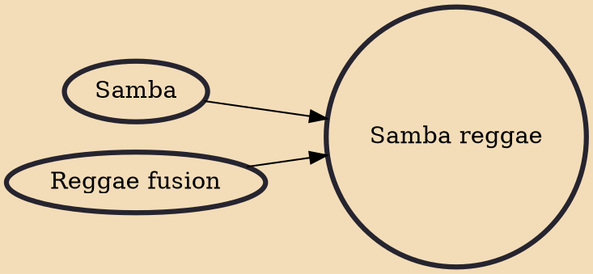

Samba-reggae is a music genre from Bahia, Brazil. Samba reggae, as its name suggests, was originally derived as a blend of Brazilian samba with Jamaican reggae as typified by Bob Marley.

## Influences

- [[Samba]]
- [[Reggae fusion]]
