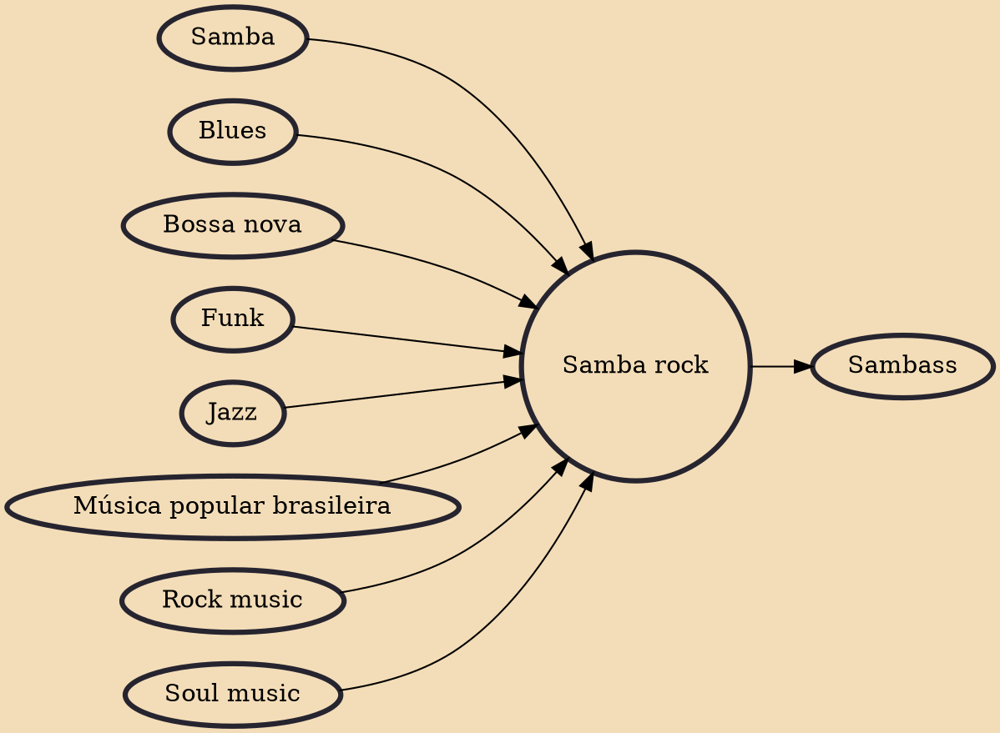

Samba rock (also known as samba soul, samba funk, and sambalanço) is a Brazilian dance culture and music genre that fuses samba with soul, rock, and funk. It emerged from the dance parties of São Paulo's lower-class black communities after they had been exposed to rock and roll and African-American music in the late 1950s.

## Influences

- [[Samba]]
- [[Blues]]
- [[Bossa nova]]
- [[Funk]]
- [[Jazz]]
- [[Música popular brasileira]]
- [[Rock music]]
- [[Soul music]]

## Derivatives

- [[Sambass]]
