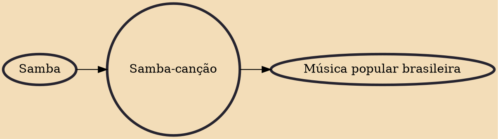

Samba-canção (Portuguese pronunciation: [ˈsɐ̃bɐ kɐ̃ˈsɐ̃w]) (literally 'samba song') is, in its most common acceptance or interpretation, the denomination for a kind of Brazilian popular songs with a slow-paced samba rhythm.

## Influences

- [[Samba]]

## Derivatives

- [[Música popular brasileira]]
