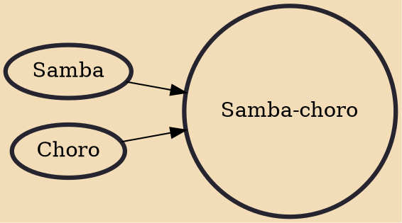

Samba-choro is a subgenre of samba that emerged in Rio de Janeiro in early 1930s in Brazil. It was a syncopated hybrid fusion of samba with the Brazilian instrumental genre choro, but with medium tempo and presence of lyrics.

## Influences
- [[Samba]]
- [[Choro]]
