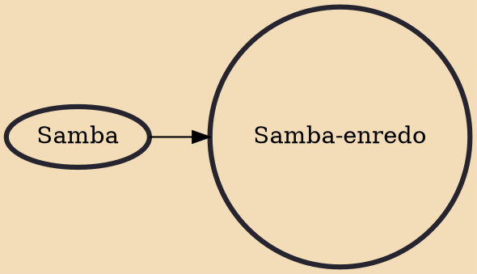

Samba-enredo, also known as samba de enredo, is a sub-genre of modern samba made specifically by a samba school for the festivities of Brazilian Carnival. It is a samba style that consists of a lyric and a melody created from a summary of the theme chosen as the plot of a samba school.

## Influences
- [[Samba]]
