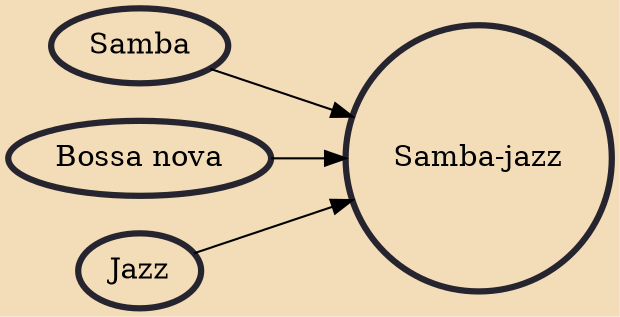

Samba-jazz or jazz samba is an instrumental subgenre of samba that emerged in the bossa nova ambit in the late 1950s and early 1960s in Brazil. The style consolidated the approach of Brazilian samba with American jazz, especially bebop and hard bop, jazzy styles quite experienced by Brazilian musicians in scope of gafieiras and nightclubs especially in Rio de Janeiro. Having its initial formation based on the piano, the double bass and the drums, samba-jazz gradually absorbed broader musical instruments.

## Influences

- [[Samba]]
- [[Bossa nova]]
- [[Jazz]]
