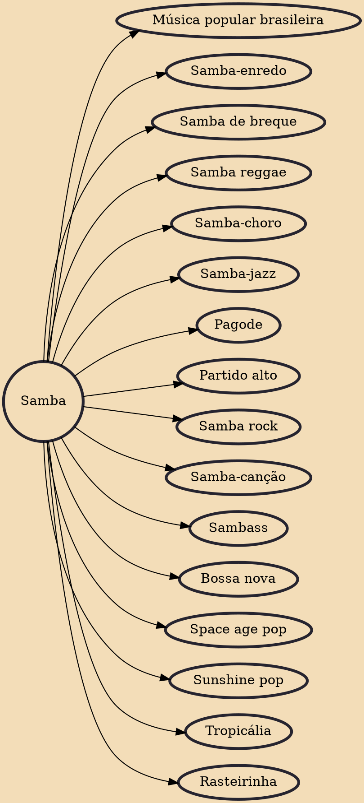

Samba (Portuguese pronunciation: [ˈsɐ̃bɐ]), also known as samba urbano carioca (urban Carioca samba) or simply samba carioca (Carioca samba), is a Brazilian music genre that originated in the Afro-Brazilian communities of Rio de Janeiro in the early 20th century. Having its roots in Brazilian folk traditions, especially those linked to the primitive rural samba of the colonial and imperial periods, it is considered one of the most important cultural phenomena in Brazil and one of the country's symbols. Present in the Portuguese language at least since the 19th century, the word "samba" was originally used to designate a "popular dance". Over time, its meaning has been extended to a "batuque-like circle dance", a dance style, and also to a "music genre". This process of establishing itse

## Derivatives

- [[Música popular brasileira]]
- [[Samba-enredo]]
- [[Samba de breque]]
- [[Samba reggae]]
- [[Samba-choro]]
- [[Samba-jazz]]
- [[Pagode]]
- [[Partido alto]]
- [[Samba rock]]
- [[Samba-canção]]
- [[Sambass]]
- [[Bossa nova]]
- [[Space age pop]]
- [[Sunshine pop]]
- [[Tropicália]]
- [[Rasteirinha]]
