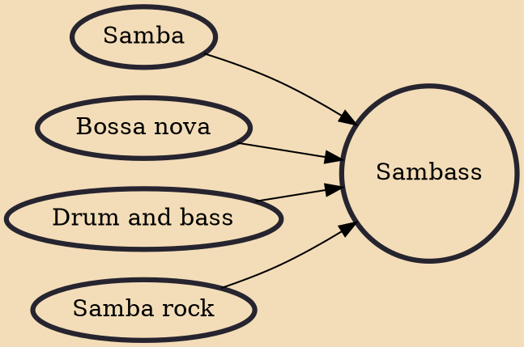

Sambass, drum 'n' bossa or drum 'n' sambass (a portmanteau of "samba" and "bass") is a regional subgenre of drum and bass music mostly native to Brazil, which combines drum and bass rhythms with influences from Latin American music. Popular artists in the genre include DJ Marky, DJ Patife, XRS Land, Drumagick, Marcelinho da Lua, Kaleidoscopio and DJ Roots. Four compilation albums titles Sambass Vol. 1 through Sambass Vol. 4 were released to international acclaim, by the Italian record label Cuadra.

## Influences

- [[Samba]]
- [[Bossa nova]]
- [[Drum and bass]]
- [[Samba rock]]
