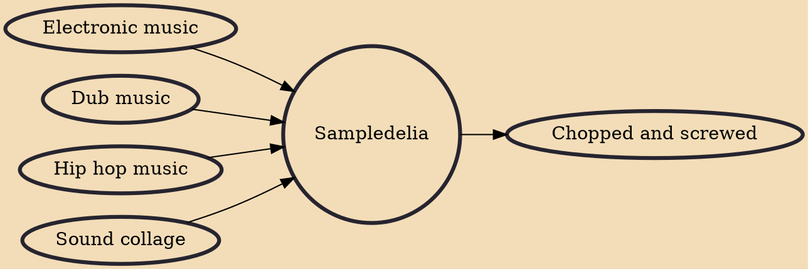

Sampledelia (also called sampledelica) is sample-based music that uses samplers or similar technology to expand upon the recording methods of 1960s psychedelia. Sampledelia features "disorienting, perception-warping" manipulations of audio samples or found sounds via techniques such as chopping, looping or stretching. Sampladelic techniques have been applied prominently in styles of electronic music and hip hop, such as trip hop, jungle, post-rock, and plunderphonics.

## Influences

- [[Electronic music]]
- [[Dub music]]
- [[Hip hop music]]
- [[Sound collage]]

## Derivatives

- [[Chopped and screwed]]
