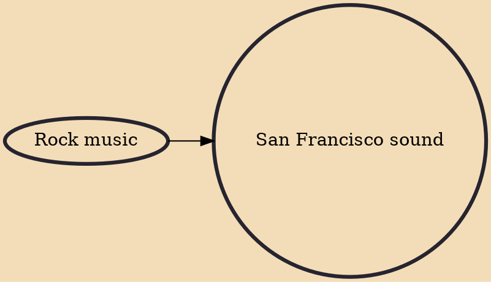

The San Francisco sound refers to rock music performed live and recorded by San Francisco-based rock groups of the mid-1960s to early 1970s. It was associated with the counterculture community in San Francisco, particularly the Haight-Ashbury district, during these years. San Francisco is a westward-looking port city, a city that at the time was 'big enough' but not manic like New York City or spread out like Los Angeles. Hence, it could support a 'scene'. According to journalist Ed Vulliamy, "A core of Haight Ashbury bands played with each other, for each other"

## Influences

- [[Rock music]]
