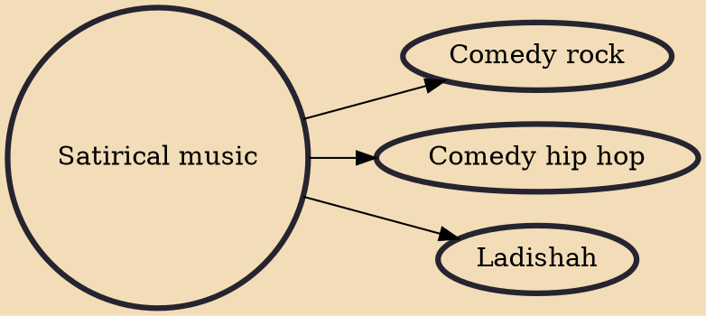

Satirical music describes music that employs satire or was described as such. It deals with themes of social, political, religious, cultural structures and provides commentary or criticism on them typically under the guise of dark humor or respective music genres. Topics include sexuality, race, culture, religion, politics, institutions, taboo subjects, morality, and the human condition.

## Derivatives
- [[Comedy rock]]
- [[Comedy hip hop]]
- [[Ladishah]]
