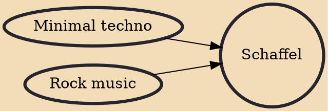

Schaffel (the German spelling to match the English pronunciation of "shuffle") is a fusion style of techno and rock in which minimal techno's straight-up drum kick shuffled to offbeat emphasis. Often triplet eighths are used to create swinging rhythms.

## Influences

- [[Minimal techno]]
- [[Rock music]]
