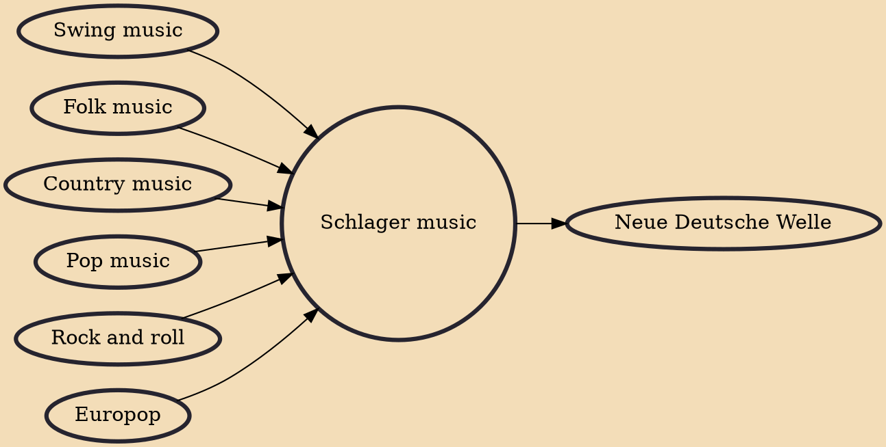

Schlager music (German: [ˈʃlaːɡɐ], "hit(s)") is a style of European popular music that is generally a catchy instrumental accompaniment to vocal pieces of pop music with simple, happy-go-lucky, and often sentimental lyrics.

## Influences

- [[Swing music]]
- [[Folk music]]
- [[Country music]]
- [[Pop music]]
- [[Rock and roll]]
- [[Europop]]

## Derivatives

- [[Neue Deutsche Welle]]
