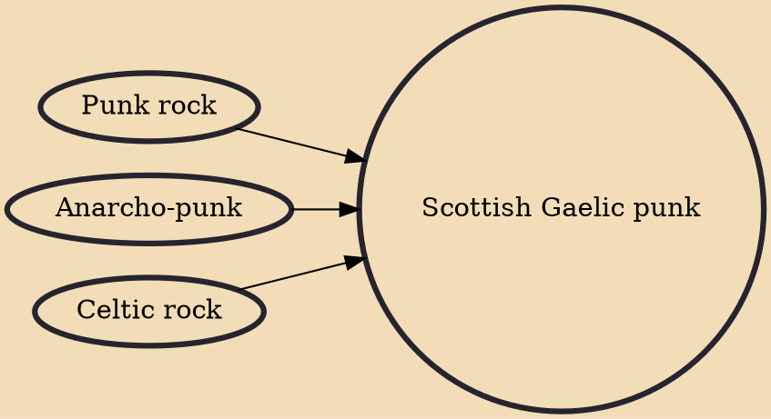

Scottish Gaelic punk (also known as Gaelic punk) is a subgenre of punk rock in which bands sing some or all of their music in Scottish Gaelic. The Gaelic punk scene is, in part, an affirmation of the value of minority languages and cultures. Gaelic punk bands express political views, particularly those related to anarchism and environmentalism.

## Influences
- [[Punk rock]]
- [[Anarcho-punk]]
- [[Celtic rock]]
