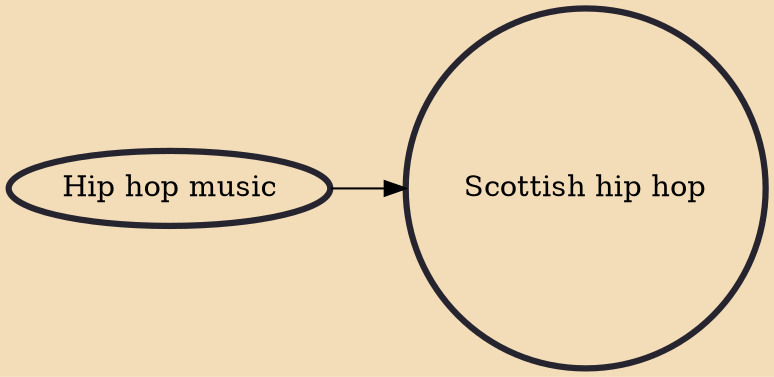

Scottish hip hop is the regional manifestation of the British hip hop culture in Scotland, comprising the five elements of MCing, DJing, beatboxing, graffiti and b-boying.

## Influences
- [[Hip hop music]]
